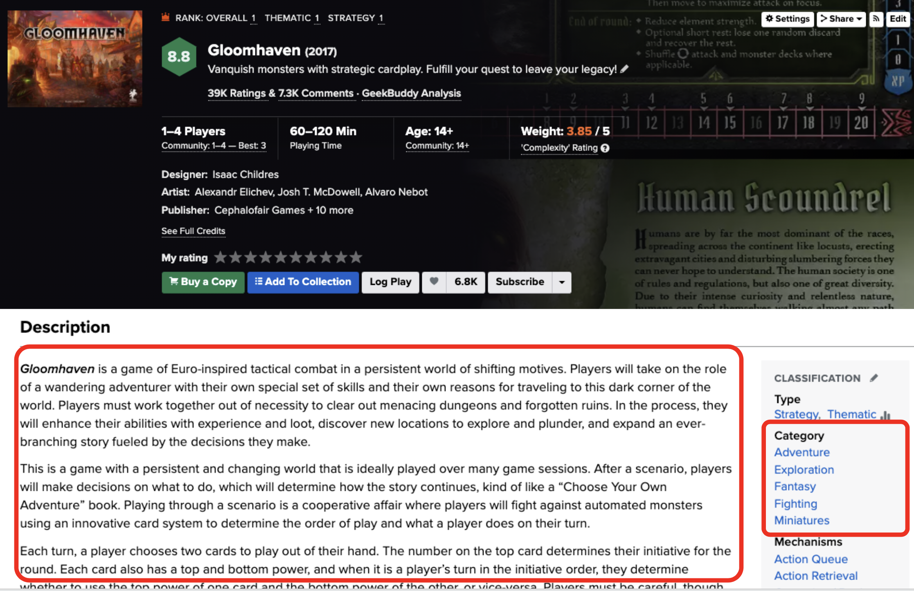
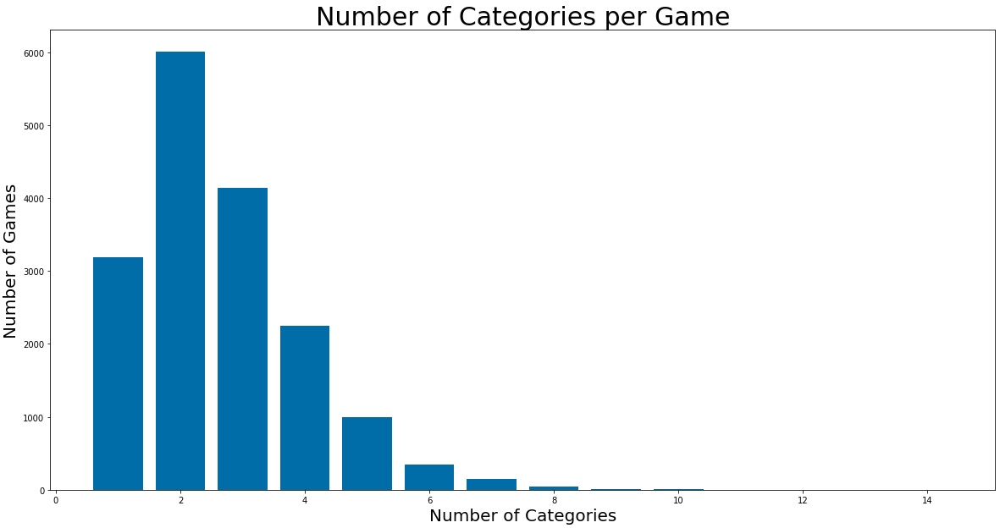
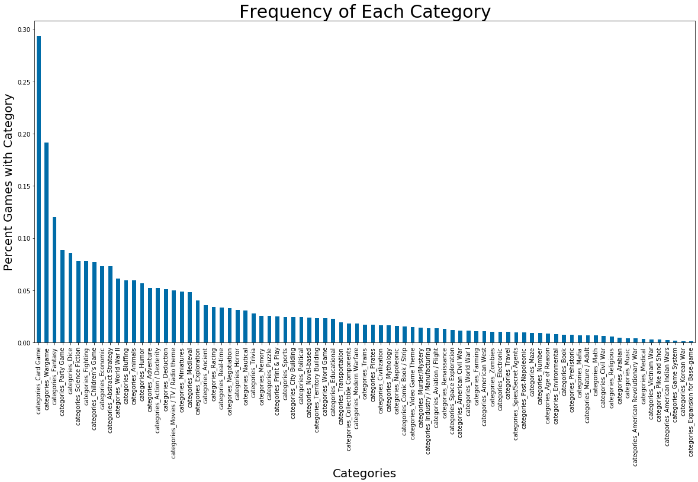
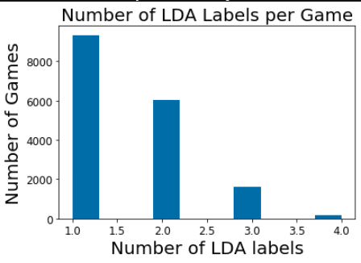
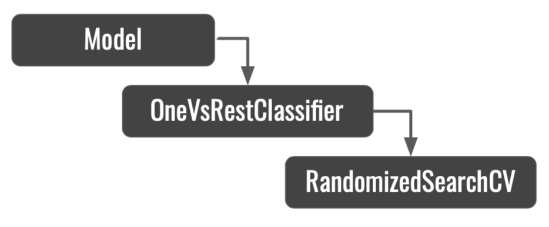
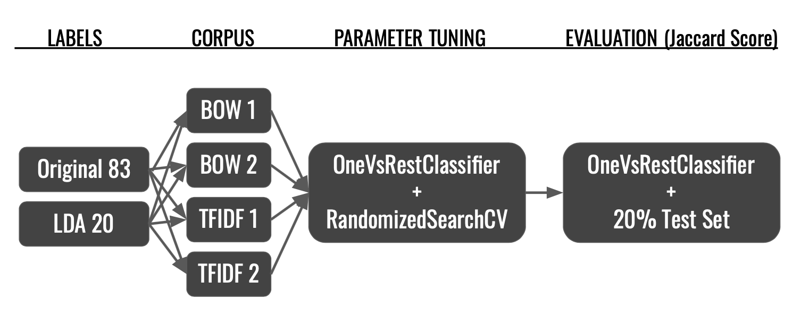
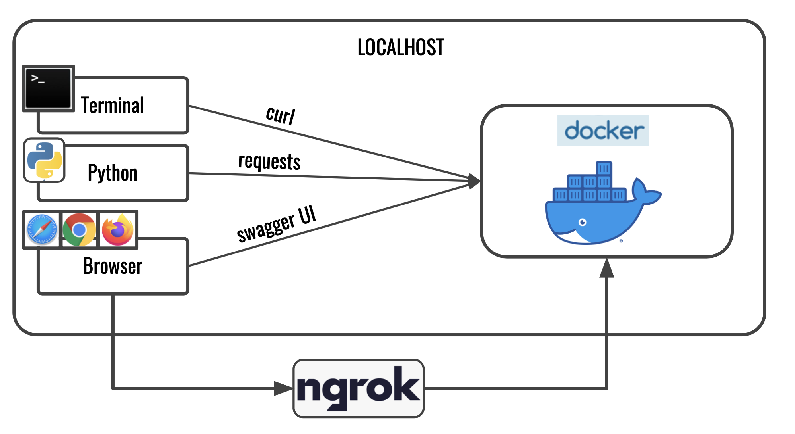
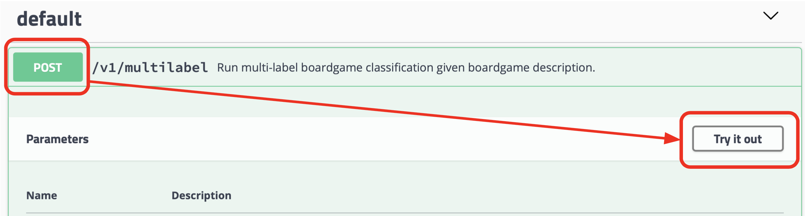
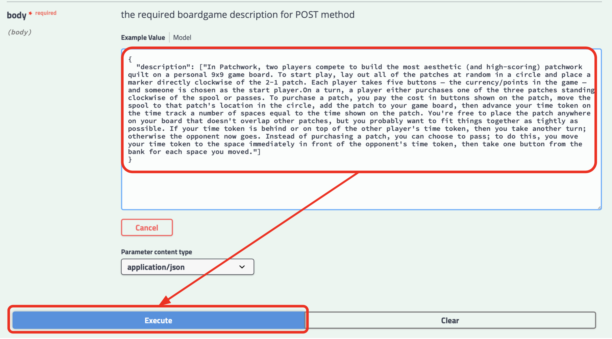
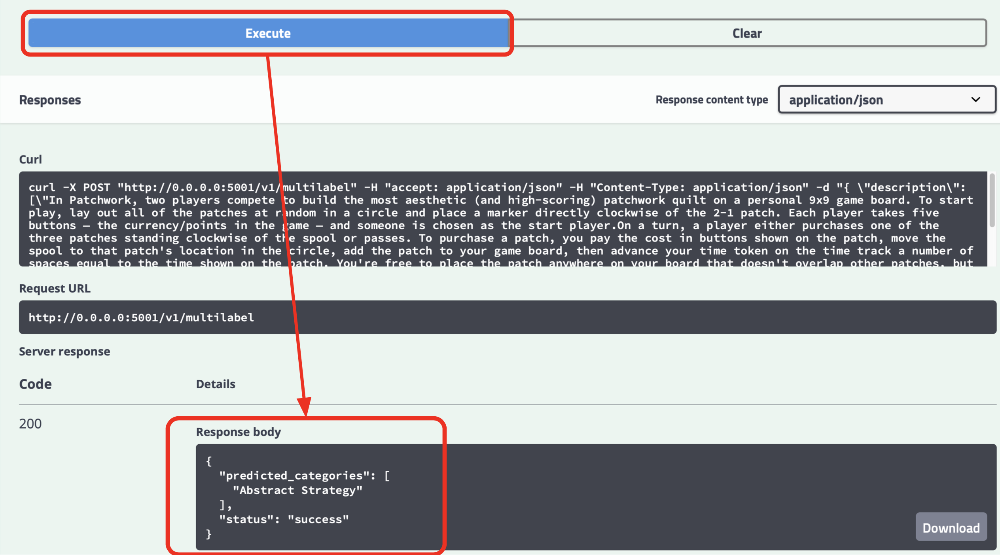

# Multi-Label Classification of Boardgames based on their descriptions

<!-- toc -->
- [JUMP TO RECREATING THE API](#recreating-the-api)
- [Directory Structure](#directory-structure)
- [Project Description](#project-description)
- [Data Description](#data-description)
- [Feature Generation](#feature-generation)
- [Target Generation](#target-generation)
- [Models Attempted](#models-attempted)
    - [Non-Deep Learning Models](#non-deep-learning-models)
    - [Deep Learning Models](#deep-learning-models)
- [Recreating the API](#recreating-the-api)
- [Testing and using the API](#testing--using-the-api)
    - [Browser Test](#browser-test)
    - [IPython Test](#ipython-test)
    - [Curl Test](#curl-test)
    - [Ngrok Test](#ngrok-test)

<!-- tocstop -->

## Directory structure 

```
├── README.md                         <- You are here
├── api.py                            <- Flask wrapper for the API
├── ngrok                             <- Executable for exposing API via web
│
├── data                               
│   ├── raw.json                      <- Raw boardgame data in JSON format.
│
├── deliverables/                     <- White paper, presentation, and proposal. 
│
├── figures/                          <- Generated graphics and figures to be used in reporting, documentation, etc
│
├── models/                           <- Trained model objects (TMOs), TFIDF vectorizer for preprocessing, boardgame categories in .pkl format
│   ├── linear_svc_ovr.pkl            <- Final Trained Model Object
│   ├── categories.pkl                <- All 83 possible categories
│   ├── tfidf_vectorizer.pkl          <- For preprocessing input data and converting to TFIDF scores
│
├── notebooks/                        <- Jupyter Notebooks with EDA and Model Experimentation
│   ├── DataEDA.ipynb                 <- Initial data preparation and exploration from data/raw.json
│   ├── Modelling.ipynb               <- All model development, feature & target generation, and evaluation
│   ├── DeepLearningBERT.ipynb        <- Notebook from Google Colab for GPU usage on finetuning BERT
│
├── src/                              <- Source data for the project 
│   ├── preprocess.py                 <- Preprocess any API input
│   ├── predict.py                    <- Use trained model object and preprocessed input to predict categories for a boardgame based ond description
│
├── Dockerfile                        <- Necessary for building Docker image 
├── requirements.txt                  <- Python package dependencies 
├── api_entrypoint                    <- Entrypoint bash commands for Docker container
```

## Project Description
- The goal of this project is to build a multi-label classification model for boardgame descriptions.
- In other words, given the description of a boardgame, assign multiple relevant categories to the boardgame.
- For example, a boardgame called “Gloomhaven” has the following description:
```
“Gloomhaven  is a game of Euro-inspired tactical combat in a persistent world of shifting motives. 
Players will take on the role of a wandering adventurer with their own special set of skills and their own reasons for traveling to this dark corner of the world. 
Players must work together out of necessity to clear out menacing dungeons and forgotten ruins. 
In the process, they will enhance their abilities with experience and loot, discover new locations to explore and plunder,
and expand an ever-branching story fueled by the decisions they make.” [truncated for brevity]
```
This boardgame is labelled with the following categories: `'Adventure', 'Exploration', 'Fantasy', 'Fighting', 'Miniatures'`.
You can see this example on [Boardgamegeek.com](https://boardgamegeek.com/boardgame/174430/gloomhaven)


## Data Description

Quick Facts about the data:  
- 17, 146 games with descriptions retrieved from [Boardgamegeek.com](https://boardgamegeek.com/wiki/page/BGG_XML_API2)
- 83 unique categories, 2.64 categories per game on average

- Only ~20 categories occur in more than 5% of games. The rest of the categories are rarer.

After tokenizing and removing stopwords, there are 1,805,528 words with a vocabulary size of 60,429. The average number of tokens in a description is 105.


See `notebooks/DataEDA.ipynb` for a bit more EDA on descriptions and categories.
The data was retrieved via the [boardgamegeek2 module](https://lcosmin.github.io/boardgamegeek/modules.html) 
which serves as a Python JSON wrapper for [BoardGameGeek.com's XML API2](https://boardgamegeek.com/wiki/page/BGG_XML_API2)

## Feature Generation
The method of feature generation can be just as important as the model chosen for the supervised learning task.  
In my experiments I generated four different corpora:
- Bag of Words with unigrams (BOW-1)
- Bag of Words with uni & bigrams (BOW-2)
- Tf-Idf with unigrams (TFIDF-1)
- Tf-Idf with uni & bigrams (TFIDF-2)

All the above corpora were “pruned” by removing any features that appear in more than 50% of all documents and in fewer than 100 documents. 
The resulting unigram corpora have 2,261 features and the uni & bigram corpora have 2,773 features.

## Target Generation
I used Latent Dirichlet Allocation as a means of reducing the number of categories from the Original 83 to LDA 20. 
The 20 LDA scores for each game are in the range \[0, 1\]. 
I converted them to binary values by calculating the average score for each game and labelling all scores above that average as a 1 while all scores below the average I labelled as 0. 
As a result, most games now had 1 or 2 LDA labels, with some having 3 or 4.


## Models Attempted 
I experimented with both deep learning and non-deep learning methods. 
The best model ends up being Linear Support Vector Classifier (LinearSVC).
The trained model object can be found in `models/linear_svc_ovr.pkl` and it is the one running in the API.
If you're not interested in the models I tested, you can skip straight to Recreating the API.

### Non-Deep Learning Models

I tried the following non-deep learning models:
- Random Forests Classifier
- Logistic Regression
- Linear Support Vector Classifier
- Radial Basis Support Vector Machines

I tested all  non-Deep Learning models on all four corpora and two label sets mentioned in the previous section. 
For each corpus, I tuned the model hyperparameters by performing 10 iterations of 3-fold cross-validation via RandomizedSearchCV. 
This accomplishes 2 goals: finding the best hyperparameters for each model and also finding which corpus works best. 
Models were scored using micro Jaccard Score to address for the imbalance in category representation and emphasize the importance of identifying 1s (this is a characteristic of the Jaccard Score). 
Finally, once the best corpus & parameters were identified, I compared all models based on their Jaccard Scores on the same 20% holdout test set.

It is important to note that the Random Forest Classifier inherently supports multi-label tasks. 
However, the same is _not_ true for all other models I tested. 
For them I used the OneVsRestClassifier from the sklearn library.
The below diagram shows the way these classes interact with each other. You can see mode information in `notebooks/Modelling.ipynb`



The entire process above can be described in the following diagram:



### Deep Learning Models

Here I tried multiple different architectures of increasing complexity:
- Fully connected layers with Dropout
- Non-static embedding layers
- One-dimensional convolutional (Conv1D) layers
- Long Short-Term Memory (LSTM) layers
- Fine tuned BERT on Google Colab GPUs

All deep learning architectures end with a fully connected layer with 83 or 20 nodes, depending on the labels being used.
For this last layer, I use binary cross-entropy loss function and the sigmoid activation function.
This is required for the multilabel setup i.e. if we want to get activation values that don't necessarily sum up to 1 i.e. non-exclusive categories.

In the end, all the deep learning models did _not_ perform better than the best non-deep learning method.
For more information on my experiments and specific performance metrics, please read the paper in `deliverable/project_PAPER.pdf`.

## Recreating the API

First, you will need to build the Docker image for the API. 
To do so, make sure Docker is running. Then run the following command in bash:
```bash
docker build -t multi_label_api -f Dockerfile .
```
If you want to change the HTTP port that gets exposed in future containers, you can specify: 
`--build-arg HTTP_PORT=5001` with the build command.

Once the image is built, you can create the container:
```bash
docker container run --publish 5001:5001  multi_label_api
```

## Testing & Using the API
There are several ways you can connect to and query the API:
- Browser via localhost
- IPython kernel with requests module
- Terminal with curl commands
- Browser via `ngrok` - a service which redirects web traffic to your localhost port.
These connectivity options are summarized in the below diagram:


### Browser Test
You could then use it by going to your browser at: 
- `http://0.0.0.0:5001/v1/multilabel/categories` -> Will return a list of all 83 possible categories
OR
- `http://0.0.0.0:5001/apidocs` -> Will show an interface for using the API 

Under POST, select "Try it out":


Then, in the white entry field enter something like:
```text
{
  "description": ["In Patchwork, two players compete to build the most aesthetic (and high-scoring) patchwork quilt on a personal 9x9 game board. To start play, lay out all of the patches at random in a circle and place a marker directly clockwise of the 2-1 patch. Each player takes five buttons — the currency/points in the game — and someone is chosen as the start player.On a turn, a player either purchases one of the three patches standing clockwise of the spool or passes. To purchase a patch, you pay the cost in buttons shown on the patch, move the spool to that patch's location in the circle, add the patch to your game board, then advance your time token on the time track a number of spaces equal to the time shown on the patch. You're free to place the patch anywhere on your board that doesn't overlap other patches, but you probably want to fit things together as tightly as possible. If your time token is behind or on top of the other player's time token, then you take another turn; otherwise the opponent now goes. Instead of purchasing a patch, you can choose to pass; to do this, you move your time token to the space immediately in front of the opponent's time token, then take one button from the bank for each space you moved."]
}
```

- Note: the description has to be in square brackets \[]
- Note: the text has to NOT have any new lines in it.
If you scroll down you will see the categories you get back


### IPython Test
You can test the API in a python kernel as well. 
If you have Python installed, then you should be able to start one in your Terminal:
```bash
ipython
```
Then use the below commands to see the available categories:
```python
import requests
response = requests.get("http://localhost:5001/v1/multilabel/categories") 
print(response)
print(response.json()) 
```
Or use the below commands to get categories for a given description
```python
import requests
response = requests.post("http://localhost:5001/v1/multilabel", json={"description":["This is a wonderful game about miniatures and dungeon crawling"]})  
response.json()
print(response)
print(response.json())
```
### Curl Test
If you want to send a command line request to the local Docker server:

```bash
curl -X POST "http://localhost:5001/v1/multilabel" \
            -H "accept: application/json" \
            -H "Content-Type: application/json" \
            -d "{ \"description\": [\"game about miniatures and dungeon crawling wonderful\"] }"
```
- Note you have to wrap your description in []

### Ngrok Test
[Ngrok](https://ngrok.com) is a service that redirects web traffic to your localhost. 
You can use this service to let someone _outside of your localhost_ access your API. 
If you want to run ngrok, run the following command from the root of the project:
```bash
./ngrok http 5001
```
The Terminal will display a URL, which you can substitute in the below URLs and open in your browser.
Categories
- `http://c57d825d11c6.ngrok.io/v1/multilabel/categories`
Interface
- `http://c57d825d11c6.ngrok.io/apidocs`

Share the URL with whomever you want to use your API. They can run the same tests you ran in the browser.

Thank you for stopping by! Happy boardgaming :)