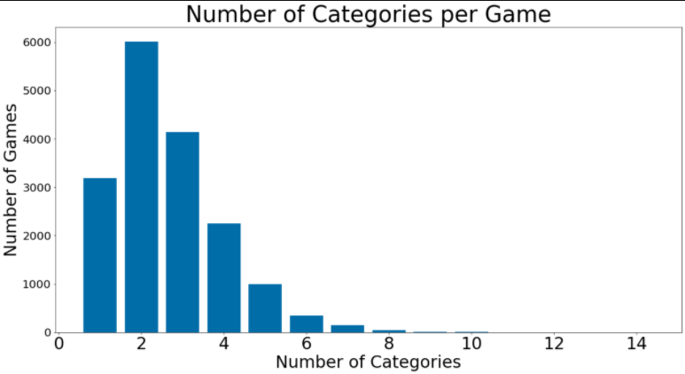
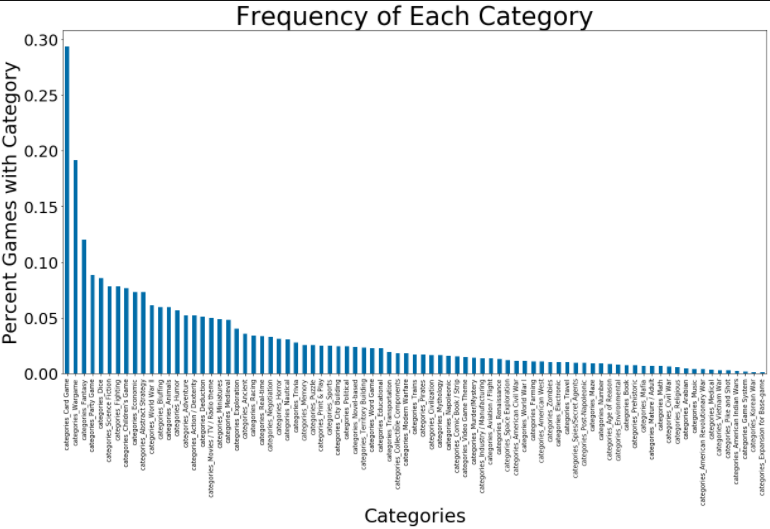
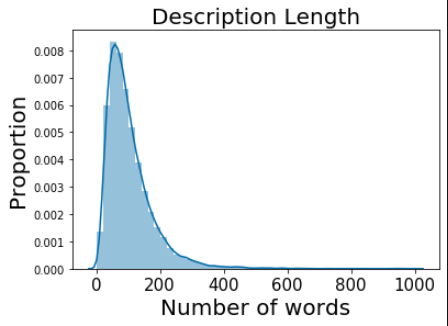

# kristiyan-dimitrov_msia_text_analytics_2020

## Project Description
- The goal of my project is to build a multi-label classification model for boardgame descriptions.
- In other words, given the description of a boardgame, assign multiple relevant categories to the boardgame.
- For example, a boardgame called “Gloomhaven” has the following description:
```
“Gloomhaven  is a game of Euro-inspired tactical combat in a persistent world of shifting motives. 
Players will take on the role of a wandering adventurer with their own special set of skills and their own reasons for traveling to this dark corner of the world. 
Players must work together out of necessity to clear out menacing dungeons and forgotten ruins. 
In the process, they will enhance their abilities with experience and loot, discover new locations to explore and plunder,
and expand an ever-branching story fueled by the decisions they make.” [truncated for brevity]
```
This boardgame is labelled with the following categories: `'Adventure', 'Exploration', 'Fantasy', 'Fighting', 'Miniatures'`.

Quick Facts about the data:  
- 17, 146 games with descriptions retrieved from [Boardgamegeek.com](https://boardgamegeek.com/wiki/page/BGG_XML_API2)
- 83 unique categories, 2.64 categories per game on average

- Only ~20 categories occur in more than 5% of games. The rest of the categories are rarer.

After tokenizing and removing stopwords, there are 1,805,528 words with a vocabulary size of 60,429. The average number of tokens in a description is 105.


See notebooks/DataEDA for a bit more EDA on descriptions and categories.  

I am planning on using Logistic Regression with BOW and TFIDF as a baseline model. I might try SVM as well.  
My ultimate goal will be to train a Neural Network with binary_crossentropy loss function and sigmoid activation function for the output layer. In effect, probabilities for each category will be calculated in a one-vs-rest fashion.  

At this stage, I am wondering how I can reduce the dimensionality of my categories i.e. how I can combine the categories. Principal Component Analysis? Singular Value Decomposition? AutoEncoder?   
Also, should I standardize my data in any way?

As a first step in investigating, I calculated pairwise Jaccard Similarity between all categories, but the below matrix shows that categories, in general, have low Jaccard Similarity i.e. few categories “go hand in hand”

